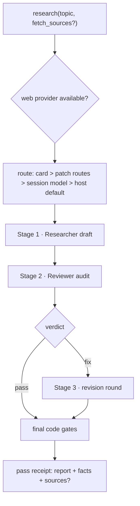

# dsh-plugin-research

Generic topic-driven deep-research DSH plugin. `research(topic, fetch_sources?)` is the only entry point — terse or detailed topics self-judge through one engine-code-driven pipeline. Three isolated stages (Researcher draft → Reviewer audit → revision round) deliver a cited report only through deterministic code gates — trust the gates, not goodwill. Topic in, report out: no file IO, no project concepts; archiving the report is the caller's job.


<details>
<summary>mermaid source (main chain; any gate failure = error receipt naming the gate)</summary>



</details>

`docs/pipeline.svg` draws the same chain with all error receipts; the mermaid above keeps the main chain only (9 nodes).

## Tools & Services

| Name       | Kind   | Shape                                                                                                                         |
| ---------- | ------ | ----------------------------------------------------------------------------------------------------------------------------- |
| `research` | Tool   | `research(topic, fetch_sources?)` → verdict receipt `{verdict, summary, details}`; render returns summary / report / appendix |
| `research` | Remote | Config-plane service (`getConfig` / `setConfig` / `listModels`) backing the settings card (see Contract)                      |

## Contract

| Item            | Rule                                                                                                                                                                                                                                |
| --------------- | ----------------------------------------------------------------------------------------------------------------------------------------------------------------------------------------------------------------------------------- |
| Report receipt  | `{case_id, status: completed\|partial, report_markdown, facts[{assertion,url,date,domain,reliability?,corroboration?}], open_questions[], sources?}`                                                                                |
| Review delivery | `{case_id, verdict: pass\|fix, issues[{point,problem,fix_hint}]}` — fix-without-issues and pass-with-issues are rejected                                                                                                            |
| Gates           | tagging (every source row carries 〔可靠性：…〕; single-source facts carry 〔单一来源〕) · fetch (`fetch_sources=true` ⇒ non-empty `sources[]`) · content (`REPORT_MIN_CHARS`, parseable URLs, facts/open_questions not both empty) |
| Routing         | single route only: card config > patch-row `routes[0]` > calling-session model > host default (reviewer follows researcher)                                                                                                         |
| Search          | host web seam (`ctx.web`); none or ambiguous = named error receipt, never a silent choice                                                                                                                                           |

## Config

| key         | Description                                                                                                     |
| ----------- | --------------------------------------------------------------------------------------------------------------- |
| `workspace` | Workspace root; default = session cwd probing (route resolution only)                                           |
| `routeKey`  | Workspace routes key (default `content-writer.researcher`)                                                      |
| `routes`    | Explicit primary route (`[{provider, model, thinkingLevel?}]`, first entry only; overridden by the card config) |

## Install

```sh
# profile package.json dependencies (local checkout until the first npm release):
"dsh-plugin-research": "link:../plugin-research"
```

Bundle row: package `dsh-plugin-research` + patch insert id `dsh-plugin-research-main` (empty config = follow). Host restart is user-owned.

## Verify

```sh
node --test tests/*.test.ts   # server logic first
pnpm check                     # prettier + tsc + full tests
pnpm check:browser             # browser-half changes only
```

## Browser half

`lib/client.js` (`./client` subpath): the `research` card on the host Plugins page (`plugins.item`, same id as the server half `settings.installSection("research")` — neither alone is visible). Collapsed to one row by default; editing stages a draft and saving is the single write point; controls use host primitives (index `docs/settings-cards.md` §1.1/§1.2, `docs/runbooks/live-verify.md`).

## Known limits

- Single route only (no fallback); with no explicit route the runner follows the calling session or host default — never throws, never picks a provider.
- The host web seam must supply a search provider; none or ambiguous = error receipt, not a silent choice.
- No file IO, no project concepts; the ledger envelope is fail-open.
- Model is free-text `provider/model` (no adapter directory); free text vs upstream option catalog is parked for the user (index debt 原#19).
