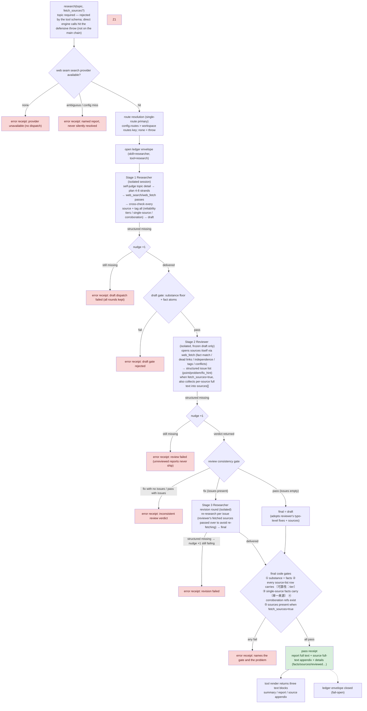

# dsh-plugin-research

Generic topic-driven deep-research DSH plugin. `research(topic, fetch_sources?)` (the only entry point; give a terse or a detailed topic — the flow self-judges). **Engine-code-driven three isolated stages**: ① a Researcher subagent plans its own research strands → targeted `web_search`/`web_fetch` passes → cross-checks every source → tags everything (reliability tiers 官方一手/权威媒体/行业报告/自媒体/论坛, single-source flags, corroboration ids) → composes the draft; ② an isolated Reviewer subagent (frozen draft only) re-verifies sources itself and returns a structured issue list (`verdict: pass | fix` + per-issue `point/problem/fix_hint`); ③ on `fix` the issues are handed back to a Researcher revision round that re-researches the flagged points. The final report must pass engine **code gates** (every source-list row carries 〔可靠性：…〕, single-source facts carry 〔单一来源〕, corroboration references exist, `fetch_sources` delivery present) or the receipt errors — trust is in the gates, not the model's goodwill. `fetch_sources=true` (optional, default false) additionally pulls the cited pages' full text back as an appendix. **Topic in, report out — zero host concepts.** Saving/archiving the report is the caller's job; this plugin does no file IO and knows nothing about projects.

Shape follows the generic deep-research references ([gpt-researcher](https://docs.gptr.dev/docs/gpt-researcher/gptr/pip-package): `query` in → report + sources metadata out; [open_deep_research](https://github.com/langchain-ai/open_deep_research): messages in → final report out).

## 合同

- Structured delivery: `{case_id, status: "completed|partial", report_markdown, facts: [{assertion,url,date,domain,title?,reliability?,corroboration?}], open_questions: string[], sources?}` — the report is the human-facing artifact, `facts[]` are machine-parseable atoms returned as receipt metadata (the `get_research_sources()` analog; `corroboration` lists corroborating `[SRC-n]` ids — absent = single source), `sources[]` carries per-source full text when `fetch_sources=true`.
- Review delivery (stage ②): `{case_id, verdict: "pass"|"fix", issues: [{point, problem, fix_hint}], report_markdown, sources?}` — code gate rejects `fix` with an empty issue list and `pass` with issues attached.
- Source tagging is the Researcher's own duty (stage ①), the Reviewer independently audits it (stage ②), and the engine's `verifyFinalReport` gate re-checks it deterministically (stage ③ output) — three layers, none optional.
- Fetch gate: when `fetch_sources=true`, an empty `sources[]` fails the gate; `content` absent = fetch failed (reported honestly, never fabricated).
- Content gate: report must reach the substance floor (`REPORT_MIN_CHARS`), fact URLs must parse, `completed` requires facts, facts and open_questions must not both be empty.
- Search provider: read from the host **web seam** (`ctx.web`) — whichever provider the profile configures (exa / deepseek) is the one used; explicit-config-miss and multi-provider ambiguity are reported honestly, never silently resolved.
- Routing: **single route** (primary only — fallback deliberately not enabled for now). Source: `config.routes[0]` > workspace routes key (default `content-writer.researcher`) > fail-loud. `workspace` is cordis config (route resolution), not a call parameter.
- Shared infrastructure comes from `aivideo-core` via `link:../aivideo-core` (the five-stage subagent runner true source).
- Project-side archiving (evidence rows into `底稿/调研.md` for the outline citation gate) is **not** this plugin's business — the writing cluster wraps this engine in its own repo (planned).

## Pipeline

mermaid source

Key property: the three stages are **mutually blind sessions** (only frozen JSON crosses between them via the engine), **every transition is decided by engine code**, and any gate failure = error receipt — an unreviewed report is never delivered.

## Config

| key         | Description                                                                      |
| ----------- | -------------------------------------------------------------------------------- |
| `workspace` | Workspace root; default = session cwd probing (route resolution only)            |
| `routeKey`  | Workspace routes key (default `content-writer.researcher`)                       |
| `routes`    | Explicit primary route (`[{provider, model, thinkingLevel?}]`, first entry only) |

## Install

Add the dependency and bundle name to the profile's `package.json`; the package ships its own `cordis.patch.yml` bundle row. Host restart is user-owned.
