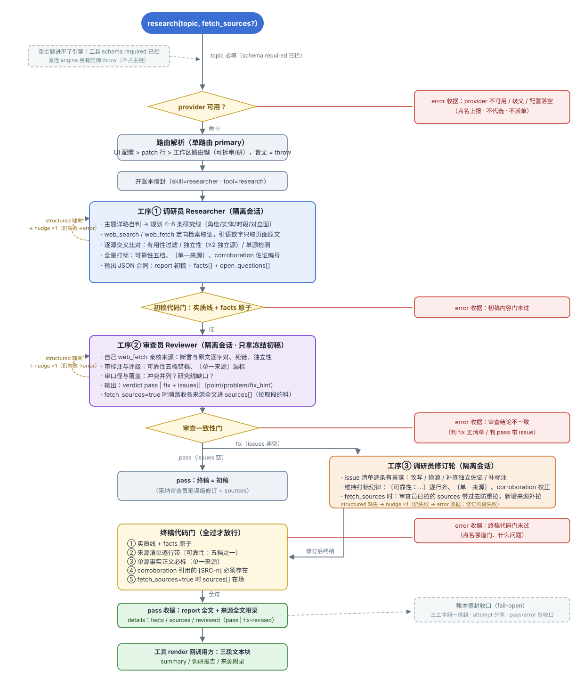
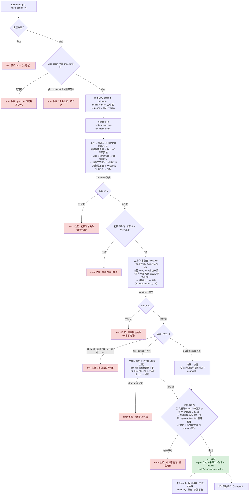

# dsh-plugin-research

通用主题式深度调研 DSH 插件。`research(topic, fetch_sources?)`（唯一入口；主题给得粗或细都行，流程自判）。**引擎代码驱动的三道隔离工序**：① 调研员（Researcher）子会话自主分解研究线 → web_search/web_fetch 定向查证 → 逐源交叉比对 → 全量打标（可靠性五档〔官方一手/权威媒体/行业报告/自媒体/论坛〕、单一来源标注、佐证编号）合成初稿；② 审查员（Reviewer，隔离会话只拿冻结初稿）亲自复核来源并出具结构化 issue 清单（`verdict: pass | fix`，每条 issue 三段式 point/problem/fix_hint）；③ 判 fix 时 issue 清单退回调研员修订轮，对存疑点重新调研补足。终稿必须过引擎**代码门**（来源清单逐行带〔可靠性：…〕、单源事实必标〔单一来源〕、corroboration 引用存在、fetch_sources 交付在场）才交回调用方——信任门，不信任模型自觉。`fetch_sources=true`（可选，缺省 false）把引用来源的页面全文拉下来随报告附回。**主题进、报告出——零宿主概念。** 报告存哪、怎么留档是调用方自己的事，本包不做任何文件 IO，也不知道「项目」是什么。

形态对齐通用 deep research 实证（[gpt-researcher](https://docs.gptr.dev/docs/gpt-researcher/gptr/pip-package)：query 进 → 报告 + 来源元数据出；[open_deep_research](https://github.com/langchain-ai/open_deep_research)：messages 进 → 最终报告出）。

## 合同

- structured 交付：`{case_id, status: "completed|partial", report_markdown, facts: [{assertion,url,date,domain,title?,reliability?,corroboration?}], open_questions: string[], sources?}`——报告是人读面，facts[] 是机器面原子（corroboration = 佐证同一断言的其他 [SRC-n] 编号，缺席 = 单一来源），随收据 details 回调用方；`fetch_sources=true` 时 sources[] 带每条来源全文。
- 审查员交付（工序②）：`{case_id, verdict: "pass"|"fix", issues: [{point, problem, fix_hint}], report_markdown, sources?}`——代码门拒收「判 fix 却没给 issue 清单」与「判 pass 却带 issue」两种不一致。
- 来源打标三层不豁免：调研员自己打标（工序①）→ 审查员独立复核（工序②）→ 引擎 `verifyFinalReport` 代码门确定性复查（工序③产出）——哪层都不过就出不了收据。
- 拉取门：`fetch_sources=true` 时 sources 空数组 = 门不过；content 缺席 = 拉取失败（如实标注，禁止编造全文）。
- 内容门：报告须达实质线（`REPORT_MIN_CHARS`）、fact URL 可解析、completed 须有 facts、facts 与 open_questions 不得双空。
- 搜索 provider：读宿主 **web seam**（`ctx.web`）——用户配的哪家（exa/deepseek）就用哪家；显式配置落空与多 provider 歧义如实上报，不代选不静默。
- 路由：**单路由**（2026-09-15 拍板：fallback 暂不启用，只取 primary）。来源：`config.routes[0]` > 工作区 routes 键（缺省 `content-writer.researcher`）> fail-loud。`workspace` 是 cordis 配置（供路由解析），不是调用参数。
- 基建取 `aivideo-core`（link:../aivideo-core——runner 五段真源）。
- 项目侧留档（证据行进 `底稿/调研.md` 供 outline 引用覆盖门消费）**不是**本插件的事——写作簇在自己的仓里包一层（挂账）。

## 流程图

mermaid 源码

要点：**三道隔离工序互不可见会话**（只经引擎传冻结 JSON），**所有环节由引擎代码判定推进**，任何一道门不过 = error 收据，绝不给未复核的报告。

## config

| key         | 说明                                                            |
| ----------- | --------------------------------------------------------------- |
| `workspace` | 工作区根；缺省 = 会话 cwd 探测（仅供路由解析）                  |
| `routeKey`  | 工作区 routes 键（缺省 `content-writer.researcher`）            |
| `routes`    | 显式主路由（`[{provider, model, thinkingLevel?}]`，只取第一条） |

## 挂载

profile `package.json` 加依赖 + `dsh.profile.bundles` 加包名；本包自带 `cordis.patch.yml` bundle 行。宿主重启只归用户。
