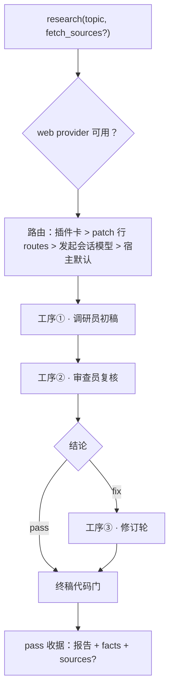

# dsh-plugin-research

通用主题式深度调研 DSH 插件。`research(topic, fetch_sources?)` 是唯一入口——主题粗细自判，全程走一条引擎代码驱动的管线。三道隔离工序（调研员初稿 → 审查员复核 → 修订轮）只经确定性代码门交付带引用的报告——信任门，不信任模型自觉。主题进、报告出：不做文件 IO，不知项目为何物；报告留档是调用方的事。


<details>
<summary>mermaid 源码（只留主链；任何一道门不过 = 点名该门的 error 收据）</summary>



</details>

`docs/pipeline.svg` 画的是同一条链（含全部 error 收据）；上面 mermaid 只留主链（9 节）。

## 工具与服务

| 名称       | 形态   | 说明                                                                                                            |
| ---------- | ------ | --------------------------------------------------------------------------------------------------------------- |
| `research` | Tool   | `research(topic, fetch_sources?)` → 结论收据 `{verdict, summary, details}`；render 回 summary / 报告 / 附录三段 |
| `research` | Remote | 配置面服务（`getConfig` / `setConfig` / `listModels`），支撑设置页配置卡（见 Contract）                         |

## Contract

| 条目     | 规则                                                                                                                                                                                    |
| -------- | --------------------------------------------------------------------------------------------------------------------------------------------------------------------------------------- |
| 报告收据 | `{case_id, status: completed\|partial, report_markdown, facts[{assertion,url,date,domain,reliability?,corroboration?}], open_questions[], sources?}`                                    |
| 审查交付 | `{case_id, verdict: pass\|fix, issues[{point,problem,fix_hint}]}`——判 fix 无清单、判 pass 带 issue 一律拒收                                                                             |
| 代码门   | 打标（来源清单逐行带〔可靠性：…〕；单源事实必标〔单一来源〕）· 拉取（`fetch_sources=true` ⇒ `sources[]` 非空）· 内容（`REPORT_MIN_CHARS`、URL 可解析、facts/open_questions 不同时为空） |
| 路由     | 只走单路由：插件卡配置 > patch 行 `routes[0]` > 发起会话模型 > 宿主默认派单（审查员缺省同调研员路由）                                                                                   |
| 搜索     | 读宿主 web seam（`ctx.web`）；缺失或歧义 = 点名上报的 error 收据，不代选不静默                                                                                                          |

## Config

| key         | 说明                                                                              |
| ----------- | --------------------------------------------------------------------------------- |
| `workspace` | 工作区根；缺省 = 会话 cwd 探测（仅供路由解析）                                    |
| `routeKey`  | 工作区 routes 键（缺省 `content-writer.researcher`）                              |
| `routes`    | 显式主路由（`[{provider, model, thinkingLevel?}]`，只取第一条；被插件卡配置覆盖） |

## Install

```sh
# profile package.json dependencies（首个 npm 版本前用本地目录）：
"dsh-plugin-research": "link:../plugin-research"
```

Bundle 行：包名 `dsh-plugin-research` + patch insert id `dsh-plugin-research-main`（空 config = 跟随）。宿主重启只归用户。

## 验证

```sh
node --test tests/*.test.ts   # 先跑服务端逻辑
pnpm check                     # prettier + tsc + 全量测试
pnpm check:browser             # 只在改浏览器半时跑
```

## Browser half

`lib/client.js`（`./client` 子路径）：宿主插件管理页上的 `research` 卡（`plugins.item`，与服务端 `settings.installSection("research")` 同 id——缺一半即隐身）。详情直出表单（不套折叠框）；封闭值域控件（下拉/勾选）改了即存，文本框改输入只落草稿、保存是其唯一写点；无丢弃按钮——草稿随离页丢弃；下拉照宿主 selectInput 同形（索引仓 `docs/settings-cards.md` §1.1/§1.2、`docs/runbooks/live-verify.md`）。

## 已知边界

- 只走单路由（无 fallback）；无显式配置时跟随发起会话或宿主默认派单——不抛错、不代选服务商。
- 搜索 provider 必须由宿主 web seam 供给；缺失或歧义 = error 收据，不静默。
- 不做文件 IO，不知项目为何物；账本信封 fail-open。
- 模型只认自由文本 `provider/model`（无 adapter 目录）；自由文本 vs 上游可选目录等用户收口径（索引仓 debt 原#19）。
